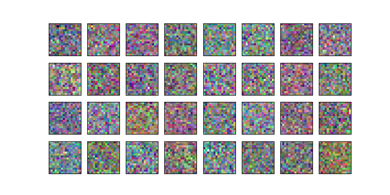

Tiny‑Diffusion is a minimal implementation of a diffusion model for generating retro video‑game sprites. It follows the core ideas from Deeplearning.AI’s diffusion intro and adds clean training/sampling utilities.

# Implementation detais

Code on GitHub

## Features
- Sprite generation at 16×16 pixels (retro style)
- DDPM training + fast DDIM sampling
- Optional context conditioning
- Animated GIFs of the denoising process

## Tech stack
- PyTorch, torchvision
- NumPy, matplotlib, pillow, tqdm

## Project structure
- `model_training.py` — training loop (with/without context), saves checkpoints
- `sampling.py` — sampling and visualization (DDPM/DDIM)
- `diffusion_utilities.py` — UNet/blocks, dataset, helpers
- `sprites_1788_16x16.npy` — training sprites (NumPy)
- `sprite_labels_nc_1788_16x16.npy` — optional context labels
- `weights/` — model checkpoints + generated GIFs

## Getting started

Install deps:
```bash
pip install torch torchvision numpy matplotlib tqdm pillow
```

Train:
```bash
python model_training.py
```

Sample:
```bash
python sampling.py
```

Outputs (checkpoints and GIFs) are written to `weights/`.

## Results
The cover GIF shows the DDIM denoising trajectory and final sprite samples.



## Customization
- Adjust architecture/hparams in `model_training.py` and `diffusion_utilities.py`
- Replace the `.npy` files with your own sprites (matching shapes)
- Toggle context conditioning in both training and sampling